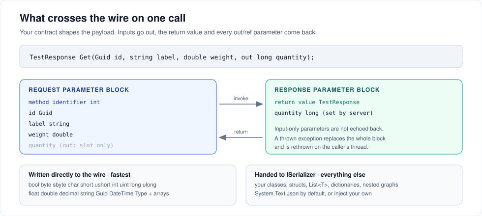

# Designing contracts

A ServiceWire contract is an ordinary C# interface. No attributes, no base interface, no partial classes. What it *can* contain is shaped by what the wire can carry.



---

## The rules in one place

| | |
| --- | --- |
| Must be an `interface` | `AddService` throws on a class |
| Methods may return `void`, any supported type, or `Task`/`Task<T>` | see [Async and Task returns](#async-and-task-returns) |
| `out` and `ref` parameters are supported | except non-primitive value types — see below |
| Overloads are fine | methods are matched by name **and** parameter types |
| Inherited interfaces are included | the host walks base interfaces too |
| Properties and indexers work | each accessor becomes a round trip — see below |
| Generic methods and events do **not** work | see below |
| Exceptions propagate | thrown on the host, rethrown on the caller |

---

## Types that ride for free

These are written straight to the wire with a one-byte type code. No serializer, no reflection, no allocation beyond the value itself:

`bool` · `byte` · `sbyte` · `char` · `short` · `ushort` · `int` · `uint` · `long` · `ulong` · `float` · `double` · `decimal` · `string` · `Guid` · `DateTime` · `Type`

…and single-dimensional arrays of every one of them.

Everything else — your classes and structs, `List<T>`, dictionaries, nested object graphs — is handed to the [serializer](serialization.md). That works fine; it is simply the slower path, which matters only in hot loops.

```csharp
public interface IReadings
{
    // fast path end to end
    double[] Recent(int count);

    // the DateTime[] is fast; the Reading[] goes through the serializer
    Reading[] Between(DateTime from, DateTime to);
}
```

### Enums

Enums are converted to their underlying integral type, so they travel on the fast path — including as `out` and `ref` parameters.

```csharp
public enum Result : ushort { Failed = 0, Ok = 1 }

public interface IJobs
{
    Result Run(int jobId, out Result detail, ref Result mode);   // works
}
```

---

## Properties, indexers, generics and events

**Properties and indexers work.** The compiler turns them into `get_`/`set_` methods, and those are proxied like any other method:

```csharp
public interface IConfig
{
    int RetryLimit { get; set; }
    string this[string key] { get; }
}

client.Proxy.RetryLimit = 5;                  // one round trip
int limit = client.Proxy.RetryLimit;          // another round trip
string value = client.Proxy["region"];        // another
```

They work, but they hide their cost. `if (proxy.RetryLimit > 0 && proxy.RetryLimit < 10)` is two network calls that read as one local comparison. Methods make the cost visible; prefer them on anything a caller might touch in a loop.

**Generic methods do not work.** The proxy cannot be built for them, and the failure happens when you construct the client, not when you call:

```csharp
T Echo<T>(T value);        // constructing the client throws
```

Use concrete overloads, or a single method taking a common base type.

**Events do not work.** The proxy is created successfully, but subscribing throws — a delegate cannot be sent across the wire:

```csharp
event EventHandler Fired;  // += throws NotSupportedException at run time
```

ServiceWire is request/response only. There is no server-initiated callback channel. If a client needs to know about something, poll for it or give the host a way to reach the client — a second ServiceWire host in the client process, for example.

---

## `out` and `ref` parameters

They work, and they come back filled in. The one restriction is **non-primitive value types by reference**: `decimal`, `Guid`, `DateTime` and your own structs cannot be `out` or `ref` parameters.

```csharp
long TestLong(out long id1, out long id2);          // fine
bool TryGet(int key, out string value);             // fine
void Adjust(ref int count);                         // fine

void Bad(out decimal amount);                       // not supported
void AlsoBad(ref Guid id);                          // not supported
```

The failure is loud and early. Constructing the client throws before any call is made:

```text
System.NotSupportedException: Non-primitive native types (e.g. Decimal and Guid)
ByRef are not supported.
   at ServiceWire.ProxyFactory.GenerateILCodeForMethod(...)
```

Return a value or a small result type instead:

```csharp
public struct Adjustment
{
    public decimal Amount { get; set; }
    public Guid Id { get; set; }
}

Adjustment Adjust(int count);                       // fine
```

Input-only parameters are not echoed back, so a large `in` argument costs one trip, not two.

Working example: [`src/Tests/ServiceWireTestCommon/TestContracts.cs`](../src/Tests/ServiceWireTestCommon/TestContracts.cs).

---

## Your own types

Any type your [serializer](serialization.md) can handle is legal. With the default serializer (System.Text.Json) that means public, settable properties and a parameterless constructor:

```csharp
public class Order
{
    public Guid Id { get; set; }
    public string Customer { get; set; }
    public List<OrderLine> Lines { get; set; }
}
```

Things that will bite you with the default serializer:

- **Read-only properties** serialize but never come back — give them setters.
- **Cyclic references** throw. Break the cycle, or inject a serializer configured to ignore loops (see [`NewtonsoftSerializer`](../src/Tests/Unit/ServiceWireTests/NewtonsoftSerializer.cs)).
- **Interface- or `object`-typed members** lose their concrete type. Use a concrete type in the contract.

No `[Serializable]` attribute is required. That requirement disappeared in 5.5.0 when `BinaryFormatter` was dropped.

---

## Async and Task returns

`Task` and `Task<T>` return types compile and run, and this is the common shape today:

```csharp
public interface IOrders
{
    Task<Order> GetAsync(Guid id);
}

var order = await client.Proxy.GetAsync(id);
```

But understand what you are getting. **RPC here is synchronous.** The `Task` wrapper is stripped on the wire; your host method runs to completion on a host thread, and the client wraps the result back into a completed `Task` before handing it to you. So:

- `await` does not release the calling thread while the call is in flight — the proxy call itself blocks, then returns an already-completed task.
- `CancellationToken` parameters have no effect across the wire.
- Exceptions still surface correctly through `await` ([test](../src/Tests/Unit/ServiceWireTests/AsyncTests.cs)).

Use `Task` returns if they fit your call sites. Do not expect them to buy you asynchrony. If you want the calling thread back, wrap the call yourself:

```csharp
var order = await Task.Run(() => client.Proxy.Get(id));
```

---

## Exceptions

When your service method throws, ServiceWire carries the exception back and rethrows it on the caller's thread. The connection survives; the next call proceeds normally.

```csharp
// host
public Statistics Summarize(IList<double> samples)
{
    if (samples.Count == 0) throw new ArgumentException("No samples supplied.");
    ...
}

// client
try
{
    client.Proxy.Summarize(empty);
}
catch (ArgumentException ex)
{
    // ex.Message, ex.HResult, ex.InnerException and the server stack trace are intact
}
```

The default serializer preserves the exception type, message, `HResult`, the inner-exception chain and the server-side stack trace. A **custom** `ISerializer` must be able to serialize exception objects too — if it cannot, the failure happens while writing the response and takes the connection with it. This is the single most common cause of "the connection dies whenever my method throws"; see [Troubleshooting](troubleshooting.md).

---

## Versioning a contract

Type identity on the wire strips assembly version, culture and public key token, and core framework types are unqualified. Two consequences:

- **A .NET Framework client can call a .NET host** and vice versa; `System.String` matches across both.
- **The contract assembly's version may differ** between the two sides. Its *name* and the namespace-qualified type names may not.

Methods are resolved by name and parameter types against the host's map, so:

| Change | Old clients | Old hosts |
| --- | --- | --- |
| Add a method | keep working | — |
| Add an interface to the host | keep working | — |
| Rename a method or change a parameter type | break | break |
| Remove a method | break if they call it | — |
| Reorder methods | keep working | keep working |

A client calling a method the host does not have gets `Cannot match method '<name>' to its server side equivalent`.

---

## Threading

Your implementation is a **singleton shared by every client**. The host runs one thread per connection and executes that connection's requests in order, but different connections run concurrently. Guard mutable state:

```csharp
public class CounterService : ICounter
{
    private int _count;
    public int Increment() => Interlocked.Increment(ref _count);
}
```

If your service implements `IDisposable`, the host disposes it when the host is closed.

---

## Next steps

- [Serialization and compression](serialization.md) — moving your own types efficiently
- [Transports and endpoints](transports.md) — where the contract is hosted
- [Interception](interception.md) — adding behaviour around methods without editing them

---

[← Back to the user guide](user-guide.md)
