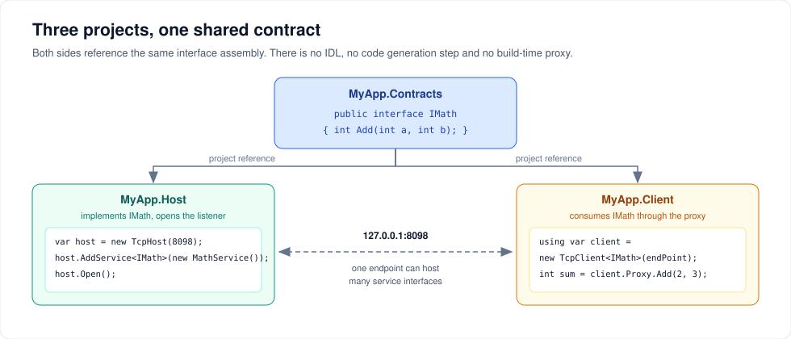

# Getting started

Ten minutes, three projects, one working RPC call. Everything below is copy-pasteable.



---

## 1. Create the projects

The contract has to be *the same assembly* on both sides, so it lives in its own class library that the host and the client both reference.

```shell
dotnet new sln -n MathDemo
dotnet new classlib -n MathDemo.Contracts
dotnet new console  -n MathDemo.Host
dotnet new console  -n MathDemo.Client

dotnet sln add MathDemo.Contracts MathDemo.Host MathDemo.Client
dotnet add MathDemo.Host   reference MathDemo.Contracts
dotnet add MathDemo.Client reference MathDemo.Contracts

dotnet add MathDemo.Host   package ServiceWire
dotnet add MathDemo.Client package ServiceWire
```

`MathDemo.Contracts` does **not** need a ServiceWire reference. It is plain interfaces and data types.

> **Important:** build for `AnyCPU` or `x64`. The runtime-generated proxy will not run as x86 on an x64 machine, and Visual Studio's console template has *Prefer 32-bit* on by default. In SDK-style projects this is `<PlatformTarget>AnyCPU</PlatformTarget>` and `<Prefer32Bit>false</Prefer32Bit>`.

---

## 2. Write the contract

`MathDemo.Contracts/IMath.cs`:

```csharp
using System;
using System.Collections.Generic;

namespace MathDemo.Contracts
{
    public interface IMath
    {
        int Add(int a, int b);

        // out and ref parameters come back filled in
        bool TryDivide(int numerator, int denominator, out int quotient);

        // your own types travel too
        Statistics Summarize(IList<double> samples);
    }

    public class Statistics
    {
        public int Count { get; set; }
        public double Mean { get; set; }
        public double Max { get; set; }
    }
}
```

No attributes, no base class, no `[Serializable]`. See [Designing contracts](contracts.md) for what a signature may and may not contain.

---

## 3. Write and host the implementation

`MathDemo.Host/Program.cs`:

```csharp
using System;
using System.Collections.Generic;
using System.Linq;
using MathDemo.Contracts;
using ServiceWire.TcpIp;

var host = new TcpHost(8098);
host.AddService<IMath>(new MathService());
host.Open();

Console.WriteLine($"Listening on {host.EndPoint}. Press Enter to stop.");
Console.ReadLine();

host.Close();

public class MathService : IMath
{
    public int Add(int a, int b) => a + b;

    public bool TryDivide(int numerator, int denominator, out int quotient)
    {
        if (denominator == 0)
        {
            quotient = 0;
            return false;
        }

        quotient = numerator / denominator;
        return true;
    }

    public Statistics Summarize(IList<double> samples)
    {
        if (samples == null || samples.Count == 0)
            throw new ArgumentException("No samples supplied.", nameof(samples));

        return new Statistics
        {
            Count = samples.Count,
            Mean = samples.Average(),
            Max = samples.Max()
        };
    }
}
```

Three rules for the host:

- **Add every service before `Open()`.** `AddService` throws once the host is open.
- **The instance you pass is a singleton.** Every client shares it, so make it thread-safe.
- **Closing the host disposes your service** if it implements `IDisposable`.

---

## 4. Call it from the client

`MathDemo.Client/Program.cs`:

```csharp
using System;
using System.Collections.Generic;
using System.Net;
using MathDemo.Contracts;
using ServiceWire.TcpIp;

var endPoint = new TcpEndPoint(new IPEndPoint(IPAddress.Loopback, 8098));

using var client = new TcpClient<IMath>(endPoint);

Console.WriteLine(client.Proxy.Add(2, 3));                  // 5

if (client.Proxy.TryDivide(22, 7, out int quotient))
    Console.WriteLine(quotient);                            // 3

var stats = client.Proxy.Summarize(new List<double> { 1.5, 2.5, 9.0 });
Console.WriteLine($"{stats.Count} samples, mean {stats.Mean:F2}, max {stats.Max}");

try
{
    client.Proxy.Summarize(new List<double>());
}
catch (ArgumentException ex)
{
    // thrown on the host, rethrown here, with the server stack trace preserved
    Console.WriteLine($"server said: {ex.Message}");
}
```

> `ServiceWire.TcpIp.TcpClient<T>` and `System.Net.Sockets.TcpClient` have the same name. If you need both namespaces in one file, alias one of them: `using SwTcpClient = ServiceWire.TcpIp.TcpClient<MathDemo.Contracts.IMath>;`

---

## 5. Run it

Two terminals:

```shell
dotnet run --project MathDemo.Host
```

```shell
dotnet run --project MathDemo.Client
```

Expected client output:

```text
5
3
3 samples, mean 4.33, max 9
server said: No samples supplied.
```

---

## The same thing over a named pipe

Both processes on one machine? Change two type names and drop the port.

```csharp
// host
using var host = new NpHost("mathdemo");
host.AddService<IMath>(new MathService());
host.Open();

// client
using var client = new NpClient<IMath>(new NpEndPoint("mathdemo"));
Console.WriteLine(client.Proxy.Add(2, 3));
```

Named pipes are roughly 2–3× cheaper per call than loopback TCP and need no port or firewall rule. [Transports and endpoints](transports.md) covers the trade-offs.

---

## Where clients and hosts fit in a real app

**Hold the client open.** Creating a `TcpClient<T>` opens a socket and fetches the method map. Do that once and reuse it — a proxy is safe to share across threads, and on TCP concurrent calls pipeline over the single connection.

```csharp
// registered as a singleton in DI, disposed on shutdown
services.AddSingleton(_ => new TcpClient<IMath>(endPoint));
services.AddSingleton(sp => sp.GetRequiredService<TcpClient<IMath>>().Proxy);
```

**Host several interfaces on one endpoint.** Each `AddService<T>` call adds another contract to the same listener; clients pick one by the type argument they ask for.

```csharp
host.AddService<IMath>(new MathService());
host.AddService<IInventory>(new InventoryService());
host.Open();
```

**Host one implementation on several endpoints.** The same singleton can be added to a `TcpHost` and an `NpHost` at once, so local callers get the fast pipe and remote callers get the socket.

---

## Next steps

- [Designing contracts](contracts.md) — what a method signature may contain
- [Serialization and compression](serialization.md) — your own types and your own serializer
- [Logging and diagnostics](observability.md) — see what the host is doing
- [Security](security.md) — authenticate callers and encrypt the link

---

[← Back to the user guide](user-guide.md)
