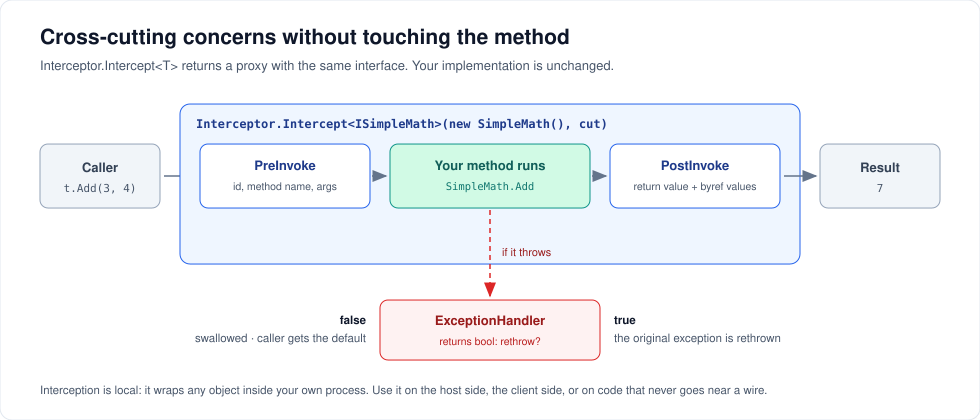

# Interception

`Interceptor.Intercept<T>` wraps any object behind its own interface and gives you three hooks: before the call, after the call, and when it throws. Your implementation is untouched.



This is **local**. It has nothing to do with hosts, clients or the wire — it works on plain objects inside one process. That also means you can apply it on the host side, the client side, or neither.

---

## The shape

```csharp
using ServiceWire.Aspects;

var cut = new CrossCuttingConcerns
{
    PreInvoke        = (id, methodName, parameters)     => { /* ... */ },
    PostInvoke       = (id, methodName, results)        => { /* ... */ },
    ExceptionHandler = (id, methodName, parameters, ex) => true   // true = rethrow
};

ISimpleMath math = Interceptor.Intercept<ISimpleMath>(new SimpleMath(), cut);

int sum = math.Add(3, 4);   // hooks fire around the real Add
```

| Hook | Signature | Called |
| --- | --- | --- |
| `PreInvoke` | `Action<int, string, object[]>` | Before the method, with the argument array |
| `PostInvoke` | `Action<int, string, object[]>` | Always, in a `finally` |
| `ExceptionHandler` | `Func<int, string, object[], Exception, bool>` | Only when the method throws |

All three are optional; leave one `null` and it is skipped.

The `int` is an instance id you choose, so one shared handler can tell several intercepted objects apart:

```csharp
var primary   = Interceptor.Intercept<IStore>(1, new Store("primary"), cut);
var secondary = Interceptor.Intercept<IStore>(2, new Store("secondary"), cut);
```

### What `PostInvoke` actually receives

This trips people up, so it is worth being precise. `PostInvoke` does **not** get the input arguments. It gets the *result* array:

- `results[0]` — the return value (`null` for `void`)
- `results[1..n]` — each `out`/`ref` parameter's final value, and `null` for input-only parameters

And because it runs in a `finally`, it also fires when the method threw:

- if the exception is being rethrown, `results` is a single-element array holding the exception
- if the handler swallowed it, `results` is a single-element array holding the return type's default

Capture the arguments in `PreInvoke` if you need them afterwards.

---

## Timing every method

```csharp
var timings = new ConcurrentDictionary<string, Stopwatch>();

var cut = new CrossCuttingConcerns
{
    PreInvoke = (id, method, args) =>
        timings[$"{id}:{method}"] = Stopwatch.StartNew(),

    PostInvoke = (id, method, results) =>
    {
        if (timings.TryRemove($"{id}:{method}", out var sw))
            logger.LogInformation("{Method} took {Ms} ms", method, sw.ElapsedMilliseconds);
    }
};
```

For concurrent callers, key the dictionary by something per-call — a `ThreadLocal<Stopwatch>` or an `AsyncLocal<T>` — since `id:method` repeats across threads.

---

## Auditing on the host side

Wrap the implementation before handing it to the host, and every remote call is audited:

```csharp
var cut = new CrossCuttingConcerns
{
    PreInvoke = (id, method, args) =>
        audit.Record(method, args.Length)     // log shapes, not values, if args can be sensitive
};

IMath audited = Interceptor.Intercept<IMath>(new MathService(), cut);

using var host = new TcpHost(8098);
host.AddService<IMath>(audited);              // clients see IMath; they cannot tell
host.Open();
```

The client is unaware. It asked for `IMath` and got `IMath`.

---

## Turning exceptions into defaults

Return `false` from `ExceptionHandler` and the exception is swallowed; the caller receives the return type's default value.

```csharp
var cut = new CrossCuttingConcerns
{
    ExceptionHandler = (id, method, args, ex) =>
    {
        logger.LogWarning(ex, "{Method} failed; returning default", method);
        return false;      // do not rethrow
    }
};

IPricing safe = Interceptor.Intercept<IPricing>(new Pricing(), cut);

decimal price = safe.Quote(sku);   // 0m if Quote threw
```

Use this deliberately. A caller that cannot tell a real zero from a swallowed failure is a bug waiting to happen — prefer returning `true` and handling the exception at the call site unless the default is genuinely correct.

If the method is `void`, returning `true` still rethrows correctly; that path has explicit test coverage.

---

## Client-side interception

The proxy is just an object implementing your interface, so you can wrap it too:

```csharp
using var client = new TcpClient<IMath>(endPoint);

IMath instrumented = Interceptor.Intercept<IMath>(client.Proxy, cut);

int sum = instrumented.Add(2, 3);   // hooks fire around the whole round trip
```

This measures the call *including* network time, which is usually what you want on the client side. Host-side interception measures the method alone.

---

## Constraints

- `TTarget` must be an **interface**. Passing a class throws `ArgumentException`.
- `target` must not be `null`.
- Interception adds one layer of indirection per call — a delegate invoke and a dictionary lookup, not a wire trip. Fine on anything but the very hottest loops.
- Disposing the intercepted proxy disposes the wrapped target if it implements `IDisposable`.

Working examples: [`InterceptionTests.cs`](../src/Tests/Unit/ServiceWireTests/InterceptionTests.cs).

---

## Next steps

- [Logging and diagnostics](observability.md) — the built-in instrumentation this complements
- [Designing contracts](contracts.md) — what the intercepted interface may contain

---

[← Back to the user guide](user-guide.md)
