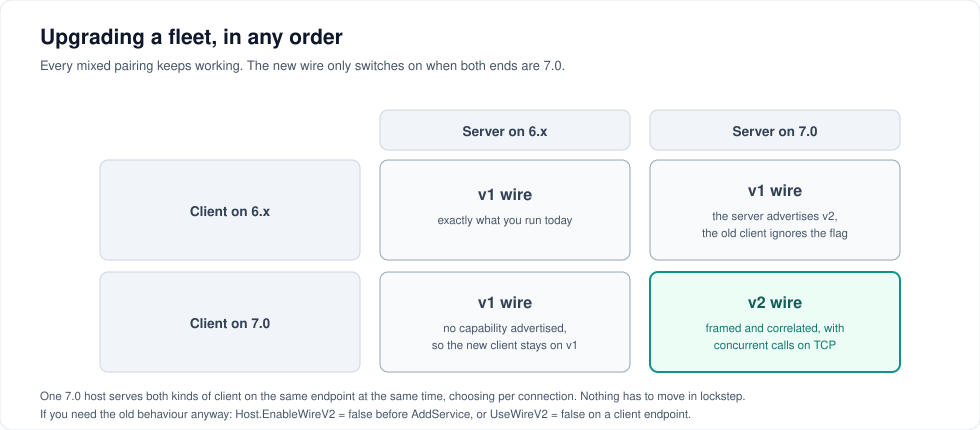

# Migrating to 7.0

7.0 is a performance release. For most applications the upgrade is a package bump and nothing else — but it is a major version, and this page says exactly why.



---

## You can upgrade in any order

A 7.0 host serves 6.x clients and 7.0 clients on the same endpoint at the same time, choosing per connection. Nothing has to move in lockstep, and there is no flag day.

| | Host on 6.x | Host on 7.0 |
| --- | --- | --- |
| **Client on 6.x** | v1 wire — unchanged | v1 wire — the host advertises v2, the old client ignores the flag |
| **Client on 7.0** | v1 wire — no capability advertised, so the client stays on v1 | **v2 wire** — framed, correlated, concurrent on TCP |

This matrix is enforced in CI: [`InteropMatrixTests.cs`](../src/Tests/Interop/InteropTests/InteropMatrixTests.cs) launches the published ServiceWire 6.0.1 package as a separate process and exercises every pairing over TCP and named pipes, with and without compression.

---

## Why it is a major version

**`ServiceSyncInfo` gained a member.** Hosts advertise capabilities through a new `int CapabilityFlags` property on the type that carries the method map.

```csharp
[DataMember(Order = 5)]
public int CapabilityFlags { get; set; }
```

Every tolerant serializer handles this: System.Text.Json ignores unknown members, protobuf-net skips unknown field numbers, Newtonsoft ignores extras by default. But if you inject a **strict** custom `ISerializer` — one configured to reject unmapped members, or one that hand-codes the field list — a 6.x client may fail to deserialize the map from a 7.0 host. Declaring it as `int` rather than an enum was deliberate, so every serializer sees a plain scalar.

That is the entire breaking surface. Everything else below is additive or a bug fix.

---

## Behaviour that changes for the better

These are fixes, but they change what your application observes, so check them against any workaround you built:

1. **Thrown exceptions no longer kill the connection.** With the default serializer, a service method that threw could not be serialized (`TargetSite` is not serializable by System.Text.Json), and the connection died. A converter now preserves the exception type, message, `HResult`, inner chain and server stack trace. If you added a catch-all in your service to avoid this, you can remove it.
2. **`string[]` above the compression threshold decodes correctly.** It was previously written with a type code no receiver could decode. It now uses `CompressedUnknown`, which every release since 1.5.0 reads.
3. **Scalar `Type` parameters work.** They previously crashed the default serializer; they now use the wire format's `Type` code.

If you have a custom `ISerializer`, point 1 is worth a test of your own — see [the exception round-trip test](serialization.md#the-one-thing-a-custom-serializer-must-get-right).

---

## New, and opt-in

Defaults preserve pre-7.0 behaviour everywhere below.

| Addition | Where | Default |
| --- | --- | --- |
| `ReceiveTimeoutMs`, `SendTimeoutMs` | `TcpEndPoint`, `TcpHost` | `0` — infinite, as before |
| `PersistentFileWriter` | `LoggerBase` | `false` — reopen per flush, as before |
| `EnableWireV2` | `Host` | `true` |
| `UseWireV2` | `TcpEndPoint`, `NpEndPoint` | `true` |

Setting socket timeouts is the one change worth making deliberately after you upgrade. Infinite is the compatible default, not the good one — see [Transports and endpoints](transports.md#tcpendpoint).

---

## Packaging

The package now multi-targets:

- **`netstandard2.0`** keeps the exact 6.x dependency graph, so existing .NET Framework and .NET Standard consumers get no new binding redirects.
- **`net8.0`** has no package dependencies at all, plus span-based fast paths that produce identical wire bytes.

The assembly version is pinned at `7.0.0.0` across both target frameworks so mixed loads bind cleanly.

---

## Upgrade checklist

1. **Bump the package** on hosts and clients, in whatever order suits you.
2. **Build for AnyCPU or x64** if you have not already. Unchanged from 6.x, but still the most common deployment failure.
3. **If you inject a custom `ISerializer`:** confirm it tolerates an unknown member on `ServiceSyncInfo`, and confirm it can round-trip an `Exception`.
4. **Set socket timeouts** on TCP endpoints and hosts.
5. **Run your integration tests.** The wire is unchanged for any pairing that includes a 6.x peer, and byte-identical on the v1 path — [golden tests](../src/Tests/Unit/ServiceWireTests/WireFormatGoldenTests.cs) assert this.
6. **Measure.** [Performance](performance.md) has what to expect; named-pipe connection setup is the one number that goes slightly the wrong way.

---

## If you need to back out

You do not have to downgrade the package. Force the classic wire instead:

```csharp
// host-wide, before AddService
host.EnableWireV2 = false;

// or per client
var endPoint = new TcpEndPoint(ipEndPoint) { UseWireV2 = false };
var pipe     = new NpEndPoint("my-pipe")   { UseWireV2 = false };
```

This keeps every Tier 1 optimisation — compiled dispatch, memoized type names, buffered pipe I/O, `NoDelay` — while putting the framing back to what 6.x sent. It is also the right setting for a strictly sequential local workload that wants the lowest possible per-call overhead.

One caveat if you replace a 7.0 host with a 6.x host **on the same endpoint while clients are running**: a client may hold a cached "supports v2" belief. ServiceWire detects the stale capability on the first v2 call, produces a descriptive error and evicts the cache so the next channel renegotiates. To clear it eagerly:

```csharp
ServiceWire.StreamingChannel.ClearCachedSyncInfo();
```

---

## Next steps

- [Wire protocol](wire-protocol.md) — what v2 actually adds
- [Performance](performance.md) — the measured effect
- [Troubleshooting](troubleshooting.md) — if something breaks

---

[← Back to the user guide](user-guide.md)
