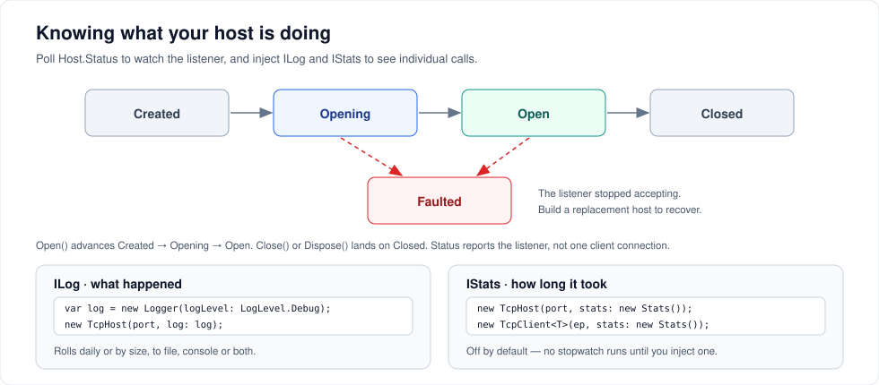

# Logging and diagnostics

Three things to watch: whether the listener is alive, what individual calls did, and how long they took.



---

## Is the host still listening?

`Host.Status` reports the **listener's** lifecycle, not the state of any one client connection.

| Value | Meaning |
| --- | --- |
| `Created` | Constructed, `Open()` not yet called |
| `Opening` | `Open()` is running |
| `Open` | Accepting connections |
| `Faulted` | The listener stopped accepting and will not recover on its own |
| `Closed` | `Close()` or `Dispose()` was called |

`Faulted` is the one that matters. A listener can die while your process keeps running happily — a bind failure, a pipe capacity problem, an unrecoverable socket error — and without checking, the first sign is silence.

```csharp
public sealed class HostSupervisor : IDisposable
{
    private TcpHost _host;
    private readonly Timer _timer;
    private readonly IMath _service = new MathService();

    public HostSupervisor()
    {
        _host = Start();
        _timer = new Timer(_ => Check(), null, TimeSpan.FromSeconds(10), TimeSpan.FromSeconds(10));
    }

    private TcpHost Start()
    {
        var host = new TcpHost(8098);
        host.AddService<IMath>(_service);
        host.Open();
        return host;
    }

    private void Check()
    {
        if (_host.Status != HostStatus.Faulted) return;

        _host.Close();                 // a faulted listener does not recover; replace it
        _host = Start();
    }

    public void Dispose()
    {
        _timer.Dispose();
        _host.Close();
    }
}
```

Note that the same singleton is handed to the replacement host, so in-memory state survives the restart.

On the client side, `IsConnected` tells you whether the underlying socket or pipe is still up. There is no automatic reconnect — dispose and rebuild the client. See [Transports and endpoints](transports.md#client-lifetime).

---

## Logging

`ILog` is five methods, all `string.Format`-style:

```csharp
public interface ILog
{
    void Debug(string formattedMessage, params object[] args);
    void Info(string formattedMessage, params object[] args);
    void Warn(string formattedMessage, params object[] args);
    void Error(string formattedMessage, params object[] args);
    void Fatal(string formattedMessage, params object[] args);
}
```

Nothing is logged unless you supply an implementation. The built-in `Logger` writes to a rolling file, the console, or both:

```csharp
using ServiceWire;

var log = new Logger(
    logDirectory: @"C:\ProgramData\Contoso\logs",
    logFilePrefix: "agent-",
    logLevel: LogLevel.Info,
    options: LogOptions.LogToBoth,
    rollOptions: LogRollOptions.Daily,
    useUtcTimeStamp: true);

using var host = new TcpHost(8098, log: log);
```

| Argument | Default | Notes |
| --- | --- | --- |
| `logDirectory` | `<assembly folder>\logs` | Created if missing; throws if it cannot be |
| `logFilePrefix` | `"log-"` | File name is `prefix + stamp + extension` |
| `logFileExtension` | `".txt"` | |
| `logLevel` | `LogLevel.Error` | `None`, `Fatal`, `Error`, `Warn`, `Info`, `Debug` |
| `messageBufferSize` | `32` | Messages buffered before a flush; clamped to 1–4096 |
| `options` | `LogOnlyToFile` | Or `LogOnlyToConsole`, `LogToBoth` |
| `rollOptions` | `Daily` | Or `Hourly`, `Size` |
| `rollMaxMegaBytes` | `1024` | Only used with `LogRollOptions.Size` |
| `useUtcTimeStamp` | `false` | |

Two members worth knowing:

- **`FlushLog()`** writes everything buffered and releases the file handle. Call it before your process exits. Closing a host flushes its `Logger` and `Stats` for you.
- **`PersistentFileWriter`** (7.0, default `false`) keeps the log file open between writes instead of reopening on every flush. Faster under heavy logging, but a held handle is visible to log shippers and rotation tools — which is why it is opt-in.

Pass the same logger to clients to see both sides of a conversation:

```csharp
using var client = new TcpClient<IMath>(endPoint, logger: log);
```

### What each level gives you

| Level | What you see |
| --- | --- |
| `Error` / `Fatal` | Listener failures, connection errors, dispatch failures |
| `Info` | Nothing extra from ServiceWire itself — use it for your own service logging |
| `Debug` | The full conversation: interface sync, method map, per-call dispatch, and for zero-knowledge connections every handshake value and payload as base64 |

`Debug` is the right first move when something will not connect, and the wrong thing to leave on. It writes payload contents to disk.

---

## Timings

`IStats` is two methods:

```csharp
public interface IStats
{
    void Log(string name, float value);
    void Log(string category, string name, float value);
}
```

ServiceWire calls it with the interface name as category and the method name as name, recording elapsed milliseconds per call. The built-in `Stats` writes them to a rolling file like `Logger`:

```csharp
using var host = new TcpHost(8098, stats: new Stats(statsDirectory: @"C:\ProgramData\Contoso\stats"));
```

**Nothing is measured unless you inject a stats implementation.** No stopwatch is started, no elapsed time computed. This is deliberate — it is why the benchmark numbers in [Performance](performance.md) are what they are — but it does mean you get zero call timings by default.

---

## Adapting to your logging stack

Wrapping `Microsoft.Extensions.Logging`, Serilog or NLog is a few lines:

```csharp
using Microsoft.Extensions.Logging;
using MelLevel = Microsoft.Extensions.Logging.LogLevel;   // ServiceWire has a LogLevel too

public class MelLogAdapter : ServiceWire.ILog
{
    private readonly ILogger _logger;

    public MelLogAdapter(ILogger logger) => _logger = logger;

    public void Debug(string message, params object[] args) => Write(MelLevel.Debug, message, args);
    public void Info(string message, params object[] args)  => Write(MelLevel.Information, message, args);
    public void Warn(string message, params object[] args)  => Write(MelLevel.Warning, message, args);
    public void Error(string message, params object[] args) => Write(MelLevel.Error, message, args);
    public void Fatal(string message, params object[] args) => Write(MelLevel.Critical, message, args);

    private void Write(MelLevel level, string message, object[] args)
    {
        if (!_logger.IsEnabled(level)) return;
        _logger.Log(level, args is { Length: > 0 } ? string.Format(message, args) : message);
    }
}
```

```csharp
using var host = new TcpHost(8098, log: new MelLogAdapter(loggerFactory.CreateLogger("ServiceWire")));
```

> **One caveat.** ServiceWire skips the cost of building debug messages only when it recognises the built-in `Logger` and sees its level below `Debug`. With any *custom* `ILog`, it assumes debug is wanted and does the formatting work — including base64-encoding payloads on zero-knowledge connections — before calling you. Your adapter can still drop the message, but the string was already built. If per-call overhead matters on a hot path, prefer the built-in `Logger`, or forward its file output to your stack.

---

## A diagnostic recipe

When a call is failing and you do not know why:

1. Turn on `LogLevel.Debug` **on both the host and the client**, writing to different directories.
2. Reproduce once. Do not loop.
3. On the client log, look for the interface sync. No sync means the connection or the contract name is the problem.
4. On the host log, look for a `MethodInvocation` entry for your call. Present means the request arrived and the problem is in your service or the response; absent means the request never made it.
5. Turn debug back off.

[Troubleshooting](troubleshooting.md) maps the most common symptoms to causes.

---

## Next steps

- [Troubleshooting](troubleshooting.md) — symptom, cause, fix
- [Performance](performance.md) — what instrumentation costs
- [Interception](interception.md) — per-method timing and auditing without touching the method

---

[← Back to the user guide](user-guide.md)
