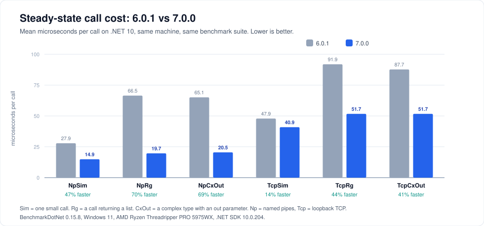

# Performance

ServiceWire is fast because it does very little per call: a compiled delegate invoke on the host, direct binary writes for common types, and one buffered flush per message. This page has the measured numbers and the handful of decisions that actually move them.



---

## The numbers

Both versions were measured with the identical benchmark suite (BenchmarkDotNet 0.15.8) on the same machine on the same day: Windows 11, AMD Ryzen Threadripper PRO 5975WX, .NET SDK 10.0.204, with 7.0.0 on its v2-wire defaults. Means are **microseconds per call**; lower is better.

### Steady state — persistent host and client

| Benchmark | .NET 10 6.0.1 | .NET 10 7.0.0 | Faster by | .NET 8 6.0.1 | .NET 8 7.0.0 | Faster by | .NET 4.8 6.0.1 | .NET 4.8 7.0.0 | Faster by |
|---|---:|---:|---:|---:|---:|---:|---:|---:|---:|
| NpSim | 27.9 | 14.9 | 47% | 27.9 | 15.3 | 45% | 32.7 | 18.0 | 45% |
| NpSimJson | 27.7 | 14.4 | 48% | 27.9 | 15.8 | 43% | 32.7 | 18.2 | 44% |
| NpRg | 66.5 | 19.7 | 70% | 72.7 | 22.9 | 68% | 129.5 | 46.9 | 64% |
| NpRgJson | 68.1 | 26.9 | 60% | 80.0 | 30.1 | 62% | 137.8 | 54.2 | 61% |
| NpCxOut | 65.1 | 20.5 | 69% | 71.0 | 22.2 | 69% | 103.3 | 36.4 | 65% |
| NpCxOutJson | 67.0 | 22.3 | 67% | 74.8 | 24.7 | 67% | 107.4 | 43.8 | 59% |
| TcpSim | 47.9 | 40.9 | 14% | 48.1 | 41.7 | 13% | 56.8 | 48.9 | 14% |
| TcpSimJson | 47.4 | 40.8 | 14% | 48.1 | 41.8 | 13% | 57.5 | 49.5 | 14% |
| TcpRg | 91.9 | 51.7 | 44% | 97.5 | 54.5 | 44% | 161.0 | 84.8 | 47% |
| TcpRgJson | 91.9 | 51.1 | 44% | 97.6 | 55.5 | 43% | 160.1 | 84.5 | 47% |
| TcpCxOut | 87.7 | 51.7 | 41% | 94.1 | 54.3 | 42% | 130.1 | 76.3 | 41% |
| TcpCxOutJson | 86.6 | 51.7 | 40% | 93.3 | 54.6 | 42% | 130.5 | 76.0 | 42% |

`Sim` is one small call. `Rg` returns a list. `CxOut` passes a complex type with an `out` parameter. `Json` variants use an injected Newtonsoft serializer instead of the default.

### Connection setup — host and client built and torn down per operation

| Benchmark | .NET 10 6.0.1 | .NET 10 7.0.0 | .NET 8 6.0.1 | .NET 8 7.0.0 | .NET 4.8 6.0.1 | .NET 4.8 7.0.0 |
|---|---:|---:|---:|---:|---:|---:|
| TcpConn | 15,385 | 1,114 | 15,496 | 1,111 | 976 | 1,083 |
| NpConn | 331 | 507 | 328 | 451 | 322 | 530 |

The 6.0.1 `TcpConn` figure of ~15.4 ms on modern runtimes is real: the old connect path busy-waited on `SpinWait.SpinUntil`, which degrades badly there. 7.0.0 uses an event wait instead, making TCP connection setup about 14× faster on .NET 8 and 10 and roughly par on .NET Framework 4.8.

Named-pipe connection setup is 0.1–0.2 ms *slower* in 7.0.0, the price of split read/write buffered streams and larger pipe buffers. The per-call savings repay that within a handful of calls on any connection that is actually used — one more reason to hold clients open.

### Shapes the suite does not cover

Measured separately on the same machine:

- A client sending an `int[1000]` over a named pipe is roughly **10× faster** in 7.0.0. The 6.x pipe client issued one write syscall per array element.
- Concurrent callers sharing one TCP proxy gain up to **2×** from v2 pipelining.
- `DateTime`-heavy payloads avoid string formatting and parsing entirely on the v2 wire.

---

## What changed in 7.0

The gains come from removing per-call work, not from a new algorithm:

1. **Compiled dispatch.** The host invokes your method through a compiled expression delegate instead of `MethodInfo.Invoke`. Methods with `byref` parameters fall back to reflection. Async results go through compiled `Task.Result` getters.
2. **Memoized type names.** Type-to-config-name resolution is cached in both directions, removing three regex passes per complex parameter per call and repeated `Type.GetType` lookups.
3. **Buffered pipe client I/O.** The named-pipe client now actually uses its `BufferedStream`, collapsing dozens of syscalls per call into one.
4. **`Socket.NoDelay`.** Both ends already buffer and flush once per message, so Nagle and delayed ACK only added latency.
5. **Pooled proxy construction.** Proxy types are created and their constructors compiled once; making a proxy is now a delegate call.
6. **Smaller odds and ends.** Larger pipe buffers, an event wait instead of a spin loop on connect, `CompressionLevel.Fastest` in the default compressor, reused cipher instances.

Everything above is independent of the wire version, so the v1 opt-outs keep all of it.

---

## Getting the most out of it

**Hold clients open.** By far the biggest lever. A client constructor opens a connection and may fetch the method map. In a loop, that dominates everything else on this page.

**Prefer fast-path types in hot signatures.** `double[]` skips the serializer; `List<double>` does not. Same for `string`, `Guid`, `DateTime` and the rest of the [natively encoded set](contracts.md#types-that-ride-for-free).

**Use named pipes when you can.** Roughly 2–3× cheaper per call than loopback TCP, and no port to manage.

**Do not enable compression reflexively.** It is off by default for a reason. It pays when large payloads cross a real network and costs when small ones cross loopback. Measure with your payloads.

**Leave instrumentation off unless you need it.** No stopwatch runs and no timing is computed until you inject an `IStats`. Debug-level logging on a custom `ILog` is more expensive still — see the caveat in [Logging and diagnostics](observability.md#adapting-to-your-logging-stack).

**Let TCP pipeline.** Sharing one proxy across threads on TCP is the intended pattern in 7.0 and worth up to 2×. Just remember the host executes one connection's requests in order, so one slow method delays what is queued behind it.

**Consider forcing v1 for sequential local work.** If your workload is strictly sequential on loopback and you want the absolute minimum per-call overhead, `UseWireV2 = false` gives about 50% better than 6.0.1 at 320 bytes per call. Any concurrency at all, or any real network, and the default v2 wins. See [Wire protocol](wire-protocol.md#the-cost-and-when-to-opt-out).

**Pick a serializer deliberately for large graphs.** The default System.Text.Json is a good general choice. Protobuf is smaller and faster for big object graphs; see [Serialization and compression](serialization.md).

---

## Running the benchmarks yourself

```shell
cd src/Benchmarks/ServiceWire.Benchmarks
dotnet run -c Release
```

That runs every benchmark across `net10.0`, `net8.0` and `net48` and opens the combined HTML report. To run one group:

```shell
dotnet run -c Release -- --filter *NamedPipesBenchmarks*
```

The `net48` job needs a 64-bit host process — the project already sets `Prefer32Bit=false` for exactly this reason.

Sources: [`TcpBenchmarks.cs`](../src/Benchmarks/ServiceWire.Benchmarks/TcpBenchmarks.cs), [`NamedPipesBenchmarks.cs`](../src/Benchmarks/ServiceWire.Benchmarks/NamedPipesBenchmarks.cs), [`ConnectionBenchmarks.cs`](../src/Benchmarks/ServiceWire.Benchmarks/ConnectionBenchmarks.cs).

---

## Appendix: the December 2024 6.x run

Kept for reference. This is ServiceWire 6.x measured across .NET 6 and .NET 8 only, before the 7.0 work. Averaged across the suite, .NET 8 was consistently about 21% faster than .NET 6.

<details>
<summary>Full BenchmarkDotNet output</summary>

```text
BenchmarkDotNet v0.14.0, Windows 11 (10.0.22631.4460/23H2/2023Update/SunValley3)
AMD Ryzen Threadripper PRO 5975WX 32-Cores, 1 CPU, 64 logical and 32 physical cores
.NET SDK 9.0.100
  [Host]   : .NET 8.0.11 (8.0.1124.51707), X64 RyuJIT AVX2
  .NET 6.0 : .NET 6.0.36 (6.0.3624.51421), X64 RyuJIT AVX2
  .NET 8.0 : .NET 8.0.11 (8.0.1124.51707), X64 RyuJIT AVX2


| Type                 | Method       | Job                | Runtime            | Mean         | Error      | StdDev     | Ratio | RatioSD | Gen0   | Gen1   | Allocated | Alloc Ratio |
|--------------------- |------------- |------------------- |------------------- |-------------:|-----------:|-----------:|------:|--------:|-------:|-------:|----------:|------------:|
| ConnectionBenchmarks | TcpConn      | .NET 6.0           | .NET 6.0           | 15,400.91 us | 204.477 us | 191.267 us |  0.99 |    0.01 |      - |      - |   62874 B |        1.00 |
| ConnectionBenchmarks | TcpConn      | .NET 8.0           | .NET 8.0           | 15,505.96 us |  76.118 us |  71.201 us |  1.00 |    0.01 |      - |      - |   62893 B |        1.00 |
|                      |              |                    |                    |              |            |            |       |         |        |        |           |             |
| NamedPipesBenchmarks | NpSim        | .NET 6.0           | .NET 6.0           |     21.64 us |   0.132 us |   0.110 us |  1.37 |    0.04 | 0.0305 |      - |     568 B |        0.89 |
| NamedPipesBenchmarks | NpSim        | .NET 8.0           | .NET 8.0           |     15.86 us |   0.311 us |   0.415 us |  1.00 |    0.04 | 0.0305 |      - |     640 B |        1.00 |
|                      |              |                    |                    |              |            |            |       |         |        |        |           |             |
| TcpBenchmarks        | TcpSim       | .NET 6.0           | .NET 6.0           |     27.60 us |   0.215 us |   0.201 us |  1.11 |    0.02 | 0.0305 |      - |     568 B |        0.89 |
| TcpBenchmarks        | TcpSim       | .NET 8.0           | .NET 8.0           |     24.94 us |   0.484 us |   0.497 us |  1.00 |    0.03 | 0.0305 |      - |     640 B |        1.00 |
|                      |              |                    |                    |              |            |            |       |         |        |        |           |             |
| ConnectionBenchmarks | NpConn       | .NET 6.0           | .NET 6.0           |    235.46 us |   3.600 us |   3.192 us |  1.16 |    0.03 | 4.3945 | 0.4883 |   68798 B |        1.02 |
| ConnectionBenchmarks | NpConn       | .NET 8.0           | .NET 8.0           |    203.27 us |   3.865 us |   3.969 us |  1.00 |    0.03 | 4.3945 | 0.4883 |   67196 B |        1.00 |
|                      |              |                    |                    |              |            |            |       |         |        |        |           |             |
| NamedPipesBenchmarks | NpSimJson    | .NET 6.0           | .NET 6.0           |     21.44 us |   0.150 us |   0.125 us |  1.35 |    0.02 | 0.0305 |      - |     568 B |        0.89 |
| NamedPipesBenchmarks | NpSimJson    | .NET 8.0           | .NET 8.0           |     15.94 us |   0.306 us |   0.286 us |  1.00 |    0.02 | 0.0305 |      - |     640 B |        1.00 |
|                      |              |                    |                    |              |            |            |       |         |        |        |           |             |
| TcpBenchmarks        | TcpSimJson   | .NET 6.0           | .NET 6.0           |     27.80 us |   0.550 us |   0.564 us |  1.14 |    0.03 | 0.0305 |      - |     568 B |        0.89 |
| TcpBenchmarks        | TcpSimJson   | .NET 8.0           | .NET 8.0           |     24.44 us |   0.299 us |   0.280 us |  1.00 |    0.02 | 0.0305 |      - |     640 B |        1.00 |
|                      |              |                    |                    |              |            |            |       |         |        |        |           |             |
| NamedPipesBenchmarks | NpRg         | .NET 6.0           | .NET 6.0           |     61.25 us |   0.710 us |   0.554 us |  1.38 |    0.03 | 0.8545 |      - |   15416 B |        1.05 |
| NamedPipesBenchmarks | NpRg         | .NET 8.0           | .NET 8.0           |     44.48 us |   0.800 us |   1.122 us |  1.00 |    0.03 | 0.9766 |      - |   14737 B |        1.00 |
|                      |              |                    |                    |              |            |            |       |         |        |        |           |             |
| TcpBenchmarks        | TcpRg        | .NET 6.0           | .NET 6.0           |     72.16 us |   1.325 us |   1.174 us |  1.37 |    0.03 | 0.8545 |      - |   15416 B |        1.05 |
| TcpBenchmarks        | TcpRg        | .NET 8.0           | .NET 8.0           |     52.70 us |   0.834 us |   0.739 us |  1.00 |    0.02 | 0.7324 |      - |   14737 B |        1.00 |
|                      |              |                    |                    |              |            |            |       |         |        |        |           |             |
| NamedPipesBenchmarks | NpRgJson     | .NET 6.0           | .NET 6.0           |     68.63 us |   0.631 us |   0.590 us |  1.39 |    0.04 | 1.7090 |      - |   27193 B |        1.09 |
| NamedPipesBenchmarks | NpRgJson     | .NET 8.0           | .NET 8.0           |     49.40 us |   0.979 us |   1.239 us |  1.00 |    0.03 | 1.4648 |      - |   24881 B |        1.00 |
|                      |              |                    |                    |              |            |            |       |         |        |        |           |             |
| TcpBenchmarks        | TcpRgJson    | .NET 6.0           | .NET 6.0           |     73.17 us |   1.181 us |   0.986 us |  1.38 |    0.03 | 0.8545 |      - |   15416 B |        1.05 |
| TcpBenchmarks        | TcpRgJson    | .NET 8.0           | .NET 8.0           |     53.03 us |   0.824 us |   0.771 us |  1.00 |    0.02 | 0.7324 |      - |   14737 B |        1.00 |
|                      |              |                    |                    |              |            |            |       |         |        |        |           |             |
| NamedPipesBenchmarks | NpCxOut      | .NET 6.0           | .NET 6.0           |     54.18 us |   0.444 us |   0.416 us |  1.25 |    0.02 | 0.3662 |      - |    6928 B |        0.86 |
| NamedPipesBenchmarks | NpCxOut      | .NET 8.0           | .NET 8.0           |     43.36 us |   0.608 us |   0.569 us |  1.00 |    0.02 | 0.3662 |      - |    8064 B |        1.00 |
|                      |              |                    |                    |              |            |            |       |         |        |        |           |             |
| TcpBenchmarks        | TcpCxOut     | .NET 6.0           | .NET 6.0           |     64.20 us |   1.172 us |   1.565 us |  1.36 |    0.04 | 0.3662 |      - |    6929 B |        0.86 |
| TcpBenchmarks        | TcpCxOut     | .NET 8.0           | .NET 8.0           |     47.21 us |   0.782 us |   0.732 us |  1.00 |    0.02 | 0.3662 |      - |    8064 B |        1.00 |
|                      |              |                    |                    |              |            |            |       |         |        |        |           |             |
| NamedPipesBenchmarks | NpCxOutJson  | .NET 6.0           | .NET 6.0           |     58.34 us |   0.904 us |   0.801 us |  1.34 |    0.02 | 0.6104 |      - |   10856 B |        0.91 |
| NamedPipesBenchmarks | NpCxOutJson  | .NET 8.0           | .NET 8.0           |     43.61 us |   0.655 us |   0.581 us |  1.00 |    0.02 | 0.7324 |      - |   11888 B |        1.00 |
|                      |              |                    |                    |              |            |            |       |         |        |        |           |             |
| TcpBenchmarks        | TcpCxOutJson | .NET 6.0           | .NET 6.0           |     63.73 us |   1.143 us |   1.069 us |  1.34 |    0.03 | 0.3662 |      - |    6929 B |        0.86 |
| TcpBenchmarks        | TcpCxOutJson | .NET 8.0           | .NET 8.0           |     47.49 us |   0.641 us |   0.600 us |  1.00 |    0.02 | 0.3662 |      - |    8064 B |        1.00 |
```

</details>

---

## Next steps

- [Wire protocol](wire-protocol.md) — the v1/v2 trade-off in detail
- [Serialization and compression](serialization.md) — the other big lever
- [Transports and endpoints](transports.md) — client lifetime and concurrency

---

[← Back to the user guide](user-guide.md)
