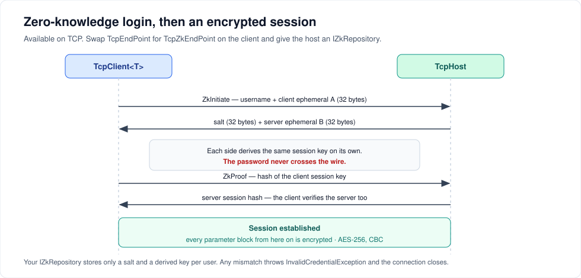

# Security

ServiceWire is built for processes that already trust each other. It gives you two mechanisms: **pipe ACLs** on named pipes, and an optional **zero-knowledge login with an encrypted session** on TCP.



---

## Read this first

ServiceWire has no TLS support. The zero-knowledge protocol below is a hand-rolled variation on SRP-6, not a standard implementation, and it has not been independently audited. Its random number generation uses `System.Random`, not a cryptographic RNG, which weakens the guarantees an attacker-facing protocol would need.

**Treat it as defence in depth on a network you already control, not as a replacement for transport security.** If the link crosses anything untrusted, put ServiceWire inside a VPN, an IPsec tunnel or an SSH tunnel, and use the zero-knowledge layer on top of that if you want per-user authentication.

On a trusted LAN, or between processes on one machine, it does what you want: callers must know a shared secret, and payloads are not readable by something sniffing the loopback adapter.

---

## Named pipes: use the ACL

There is no ServiceWire-level authentication on named pipes, because the operating system already has one. Supply an `INamedPipeServerStreamFactory` and set the pipe security descriptor — see [Transports and endpoints](transports.md#controlling-who-may-connect) for a complete example.

That is the right tool for the desktop-app-to-service case: the service runs as `LocalSystem`, the pipe grants `ReadWrite` to `BUILTIN\Users`, and Windows enforces it before a single byte of ServiceWire traffic is exchanged.

---

## TCP: zero-knowledge login

### How it works

1. The client sends its username and an ephemeral value. The password is not sent.
2. The host looks the user up through your `IZkRepository` and answers with the stored salt and its own ephemeral value.
3. Both sides independently derive the same session key from what they each already know.
4. The client proves it derived the right key by sending a hash of it; the host verifies, then proves the same thing back so the client knows it is talking to the real host.
5. From that point every parameter block — including the interface sync — is encrypted with AES-256 in CBC mode using the session key.

Any mismatch throws `InvalidCredentialException` on the client and closes the connection.

### Storing credentials

`ZkProtocol.HashCredentials` generates a **new random salt every time it is called**. Call it once when the user is created, persist the result, and never call it again for that user — a fresh hash will not match.

```csharp
// registration, once
var protocol = new ZkProtocol();
ZkPasswordHash hash = protocol.HashCredentials(username, password);

// persist hash.Salt, hash.Key and hash.Verifier — all three
db.SaveCredentials(username, hash.Salt, hash.Key, hash.Verifier);
```

Store the three byte arrays. Do not store the password.

### The repository

```csharp
using ServiceWire.ZeroKnowledge;

public class SqlZkRepository : IZkRepository
{
    private readonly ICredentialStore _store;

    public SqlZkRepository(ICredentialStore store) => _store = store;

    public ZkPasswordHash GetPasswordHashSet(string username)
    {
        var row = _store.Find(username);
        if (row is null) return null;          // null means "no such user" — the login fails

        return new ZkPasswordHash
        {
            Salt = row.Salt,
            Key = row.Key,
            Verifier = row.Verifier
        };
    }
}
```

`GetPasswordHashSet` is called on the connection thread during the handshake, so keep it fast and make it thread-safe. Cache if your store is slow.

### Wiring it up

```csharp
// host — passing a repository turns zero-knowledge on for the whole host
using var host = new TcpHost(8098, zkRepository: new SqlZkRepository(store));
host.AddService<IMath>(new MathService());
host.Open();

// client — swap TcpEndPoint for TcpZkEndPoint
var endPoint = new TcpZkEndPoint("alice@contoso.com", "the-password",
                                 new IPEndPoint(ip, 8098), connectTimeOutMs: 5000);

using var client = new TcpClient<IMath>(endPoint);
int sum = client.Proxy.Add(2, 3);          // encrypted, like every call after the handshake
```

That is the whole difference on the client: one endpoint type. Everything else — the contract, the proxy, the calls — is unchanged.

A working pair is in [`TcpZkTests.cs`](../src/Tests/Unit/ServiceWireTests/TcpZkTests.cs) and in the commented-out lines of [`DemoClient/Program.cs`](../src/Demo/DemoClient/Program.cs).

### Three things to know

- **It is all or nothing per host.** A host with a repository requires every client to authenticate. Clients using a plain `TcpEndPoint` against it will fail. Run two hosts on two ports if you need both.
- **It is TCP only.** `NpHost` has no zero-knowledge option; use pipe ACLs.
- **The handshake costs a round trip or two.** It happens once per client, at construction. One more reason to hold clients open rather than creating them per call.

---

## Hardening checklist

| | |
| --- | --- |
| Bind to a specific interface, not `IPAddress.Any`, when the host only serves one network | `new TcpHost(new IPEndPoint(IPAddress.Parse("10.0.0.7"), 8098))` |
| Set socket timeouts so a stalled or hostile peer cannot hold a thread forever | `ReceiveTimeoutMs`, `SendTimeoutMs` |
| Validate arguments in your service methods | a client is another process; treat its input as input |
| Keep the contract minimal | every method on the interface is reachable by every caller |
| Do not log parameter values in production | `LogLevel.Debug` writes payloads, including credentials, to disk |
| Tunnel anything crossing an untrusted network | VPN, IPsec or SSH |

That last-but-one point is worth repeating: debug logging is verbose by design and will write base64 payloads to your log file. Use it while diagnosing, then turn it back down.

---

## Next steps

- [Transports and endpoints](transports.md) — pipe ACLs and socket timeouts
- [Logging and diagnostics](observability.md) — what debug logging actually emits
- [Troubleshooting](troubleshooting.md) — when the handshake fails

---

[← Back to the user guide](user-guide.md)
