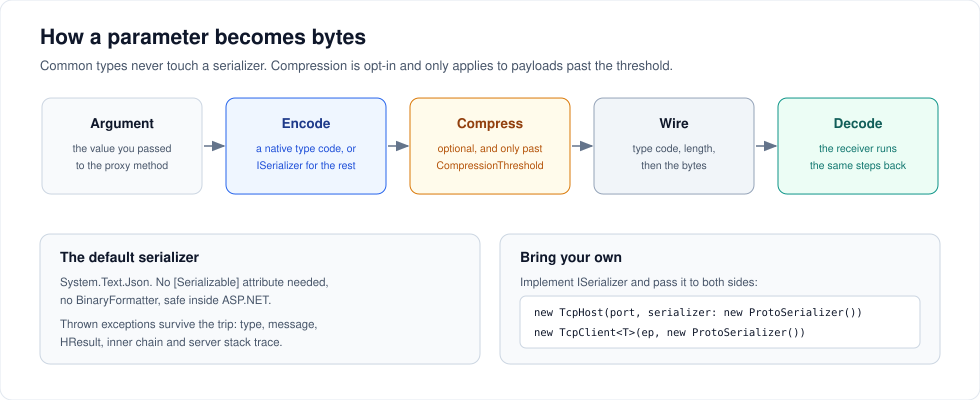

# Serialization and compression

Most parameters never touch a serializer. The ones that do are yours to control.



---

## Two paths

Every parameter is written as a one-byte type code followed by its value.

**The fast path** covers `bool`, `byte`, `sbyte`, `char`, `short`, `ushort`, `int`, `uint`, `long`, `ulong`, `float`, `double`, `decimal`, `string`, `Guid`, `DateTime`, `Type` and single-dimensional arrays of all of them. These are written directly by `BinaryWriter`. There is no reflection and no serializer call.

**The serializer path** covers everything else — your classes and structs, `List<T>`, dictionaries, nested graphs. The object is serialized to a byte array, and the array is written with an "unknown type" code plus the type name so the receiver knows what to rebuild.

If a call is on a hot path and its arguments are large, prefer the fast-path shapes. Sending `double[]` instead of `List<double>` skips serialization entirely on both ends.

---

## The default serializer

`DefaultSerializer` wraps `System.Text.Json`. You get it automatically when you pass nothing.

- **No `[Serializable]` attribute required.** That requirement went away in 5.5.0.
- **No `BinaryFormatter`**, so ServiceWire is safe to use inside ASP.NET without `EnableUnsafeBinaryFormatterSerialization`.
- **Exceptions round-trip.** A converter preserves the exception type, message, `HResult`, the inner-exception chain and the server stack trace, so a method that throws does not kill the connection.

What it expects of your types: public settable properties, a parameterless constructor, no reference cycles, and concrete member types rather than `object` or interfaces.

---

## Injecting your own serializer

Implement `ISerializer`:

```csharp
public interface ISerializer
{
    byte[] Serialize<T>(T obj);
    byte[] Serialize(object obj, string typeConfigName);
    T Deserialize<T>(byte[] bytes);
    object Deserialize(byte[] bytes, string typeConfigName);
}
```

`typeConfigName` is ServiceWire's name for a type — the assembly-qualified name with version, culture and public key token stripped. Two public extension methods do the conversions for you:

```csharp
using ServiceWire;

Type t = typeConfigName.ToType();   // name  -> Type
object empty = t.GetDefault();      // Type  -> default(T) as an object
```

Pass the same instance to **both sides**. A host and a client with different serializers will not understand each other.

```csharp
var serializer = new NewtonsoftSerializer();

// host
using var host = new TcpHost(8098, serializer: serializer);
host.AddService<IMath>(new MathService());
host.Open();

// client
using var client = new TcpClient<IMath>(endPoint, serializer);
```

### A complete example

```csharp
using System;
using System.Text;
using System.Text.Json;
using ServiceWire;

public class RelaxedJsonSerializer : ISerializer
{
    private static readonly JsonSerializerOptions Options = new()
    {
        PropertyNameCaseInsensitive = true,
        IncludeFields = true,
        NumberHandling = System.Text.Json.Serialization.JsonNumberHandling.AllowReadingFromString
    };

    public byte[] Serialize<T>(T obj) =>
        obj is null ? null : JsonSerializer.SerializeToUtf8Bytes(obj, Options);

    public byte[] Serialize(object obj, string typeConfigName) =>
        obj is null ? null : JsonSerializer.SerializeToUtf8Bytes(obj, typeConfigName.ToType(), Options);

    public T Deserialize<T>(byte[] bytes) =>
        bytes is null || bytes.Length == 0 ? default : JsonSerializer.Deserialize<T>(bytes, Options);

    public object Deserialize(byte[] bytes, string typeConfigName)
    {
        if (typeConfigName is null) throw new ArgumentNullException(nameof(typeConfigName));
        var type = typeConfigName.ToType();
        return bytes is null || bytes.Length == 0 ? type.GetDefault()
                                                  : JsonSerializer.Deserialize(bytes, type, Options);
    }
}
```

### Serializers already written for you

| Implementation | Where | Why |
| --- | --- | --- |
| `NewtonsoftSerializer` | [test source](../src/Tests/Unit/ServiceWireTests/NewtonsoftSerializer.cs) | Cyclic graphs, `TypeNameHandling`, legacy contracts |
| `ProtobufSerializer` | [test source](../src/Tests/Unit/ServiceWireTests/ProtobufSerializer.cs) | Smaller and faster than JSON for large object graphs |
| `CustomPipeSerializer` | [test source](../src/Tests/Unit/ServiceWireTests/AsyncTests.cs) | System.Text.Json with your own options |
| `BinaryFormatterSerializer` | [`src/Serializers`](../src/Serializers/ServiceWire.Serializers/BinaryFormatterSerializer.cs) | The pre-5.5.0 default, for contracts that depend on its exact behaviour |

`BinaryFormatterSerializer` is provided for compatibility only. `BinaryFormatter` is obsolete and blocked by default on modern .NET; do not adopt it in new code.

### The one thing a custom serializer must get right

**It has to serialize exceptions.** When your service method throws, the exception object goes through `Serialize`. If that fails, the failure happens while writing the response and the connection dies. Test it:

```csharp
[Fact]
public void CustomSerializer_RoundTripsExceptions()
{
    var s = new MyCustomSerializer();
    var bytes = s.Serialize<Exception>(new InvalidOperationException("boom"));
    var back = s.Deserialize<Exception>(bytes);
    Assert.Equal("boom", back.Message);
}
```

---

## Compression

Compression is **off by default** and configured on the host. The host's settings travel to clients in the method map, so both directions use them — you do not configure the client.

```csharp
var host = new TcpHost(8098);
host.UseCompression = true;
host.CompressionThreshold = 64 * 1024;   // bytes
host.AddService<IBulkData>(new BulkDataService());
host.Open();
```

> **Set these before `AddService`.** The values are captured into the method map when the service is added; changing them afterwards has no effect on clients.

| Property | Default | Notes |
| --- | --- | --- |
| `UseCompression` | `false` | Applies to strings, byte and char arrays, and serialized complex types |
| `CompressionThreshold` | `131072` (128 KB) | Values below this are never compressed. Minimum 1024; smaller values are clamped |

Compression costs CPU on both ends. It pays off when you move large payloads over a real network and loses when you move small ones over loopback. Measure before enabling it.

### Custom compression

```csharp
public interface ICompressor
{
    byte[] Compress(byte[] data);
    byte[] DeCompress(byte[] compressedBytes);
}
```

The default is GZip at `CompressionLevel.Fastest`. To swap in something else — LZ4, Brotli, Zstandard — implement `ICompressor` and pass it to both sides:

```csharp
using var host   = new TcpHost(8098, compressor: new BrotliCompressor());
using var client = new TcpClient<IMath>(endPoint, compressor: new BrotliCompressor());
```

Like the serializer, both ends must agree.

---

## Choosing sensibly

| Payload | Do this |
| --- | --- |
| Small values, high call rate | Fast-path types; leave compression off |
| Large arrays of primitives | Fast-path arrays (`double[]`, not `List<double>`) |
| Large object graphs, local | Default serializer, compression off |
| Large object graphs, over a network | Consider Protobuf, and turn compression on with a threshold you have measured |
| Interop with an existing JSON contract | Newtonsoft with your own settings |

---

## Next steps

- [Designing contracts](contracts.md) — which types belong in a signature
- [Performance](performance.md) — what these choices cost, measured
- [Security](security.md) — encrypting the payload as well as compressing it

---

[← Back to the user guide](user-guide.md)
