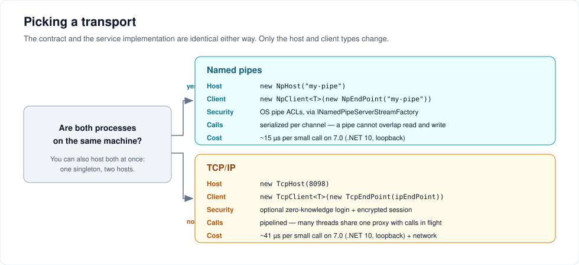

# Transports and endpoints

The contract and the implementation never change. Only the host and client types do.



---

## Named pipes

Best choice when both processes are on one machine: no port, no firewall rule, and the operating system already knows who is on the other end.

```csharp
using ServiceWire.NamedPipes;

// host
using var host = new NpHost("contoso-agent");
host.AddService<IMath>(new MathService());
host.Open();

// client
using var client = new NpClient<IMath>(new NpEndPoint("contoso-agent"));
int sum = client.Proxy.Add(2, 3);
```

### `NpHost`

```csharp
public NpHost(string pipeName,
              ILog log = null,
              IStats stats = null,
              ISerializer serializer = null,
              ICompressor compressor = null,
              INamedPipeServerStreamFactory streamFactory = null)
```

| Member | Notes |
| --- | --- |
| `PipeName` | The name you passed |
| `UseThreadPool` | Serve connections on pool threads instead of dedicated ones. Must be set before `Open()` |
| `Status` | Listener lifecycle — see [Logging and diagnostics](observability.md) |

The listener accepts up to 254 concurrent connections, the Windows ceiling for a single pipe name.

### `NpEndPoint`

```csharp
new NpEndPoint("contoso-agent")                          // local machine, 2500 ms connect timeout
new NpEndPoint("contoso-agent", connectTimeOutMs: 5000)
new NpEndPoint("FILESRV01", "contoso-agent", 5000)       // a pipe on another Windows host
```

| Property | Default | Notes |
| --- | --- | --- |
| `ServerName` | `"."` | `.` is the local machine |
| `PipeName` | — | Must match the host |
| `ConnectTimeOutMs` | `2500` | How long the constructor waits for the pipe |
| `UseWireV2` | `true` | Set `false` to force the classic wire ([details](wire-protocol.md)) |

### Controlling who may connect

A pipe's ACL is the access control. Supply an `INamedPipeServerStreamFactory` to set it — this is how you let a desktop app talk to a service running as `LocalSystem` without opening it to everyone.

```csharp
using System.IO.Pipes;
using System.Security.AccessControl;
using System.Security.Principal;
using ServiceWire.NamedPipes;

public class RestrictedPipeFactory : INamedPipeServerStreamFactory
{
    public NamedPipeServerStream Create(string pipeName, PipeDirection direction,
        int maxNumberOfServerInstances, PipeTransmissionMode transmissionMode,
        PipeOptions options, int inBufferSize, int outBufferSize)
    {
        var security = new PipeSecurity();
        security.AddAccessRule(new PipeAccessRule(
            new SecurityIdentifier(WellKnownSidType.BuiltinUsersSid, null),
            PipeAccessRights.ReadWrite, AccessControlType.Allow));
        security.AddAccessRule(new PipeAccessRule(
            new SecurityIdentifier(WellKnownSidType.LocalSystemSid, null),
            PipeAccessRights.FullControl, AccessControlType.Allow));

        return NamedPipeServerStreamAcl.Create(pipeName, direction, maxNumberOfServerInstances,
            transmissionMode, options, inBufferSize, outBufferSize, security);
    }
}

using var host = new NpHost("contoso-agent", streamFactory: new RestrictedPipeFactory());
```

`NamedPipeServerStreamAcl` is Windows-only and lives in the `System.IO.Pipes.AccessControl` package on .NET Core and later. Without a factory, ServiceWire uses the default pipe security for the account that created it.

### One thing to know

A synchronous pipe handle cannot overlap a read with a write, so calls on a single `NpClient<T>` are serialized end to end. Sharing one pipe proxy across many threads is safe but will not overlap work — give each worker its own client if you need parallelism, or use TCP.

---

## TCP

For anything crossing a machine boundary, and the only transport that supports [zero-knowledge authentication and encryption](security.md).

```csharp
using System.Net;
using ServiceWire.TcpIp;

// host — binds IPAddress.Any
using var host = new TcpHost(8098);
host.AddService<IMath>(new MathService());
host.Open();

// host — bind a specific interface instead
using var host2 = new TcpHost(new IPEndPoint(IPAddress.Parse("10.0.0.7"), 8098));

// client
var endPoint = new TcpEndPoint(new IPEndPoint(IPAddress.Parse("10.0.0.7"), 8098));
using var client = new TcpClient<IMath>(endPoint);
```

### `TcpHost`

```csharp
public TcpHost(int port, ILog log = null, IStats stats = null,
               IZkRepository zkRepository = null,
               ISerializer serializer = null, ICompressor compressor = null)

public TcpHost(IPEndPoint endpoint, /* same optional arguments */)
```

| Member | Default | Notes |
| --- | --- | --- |
| `EndPoint` | — | What the listener bound to |
| `ReceiveTimeoutMs` | `0` (infinite) | Applied to accepted client sockets |
| `SendTimeoutMs` | `0` (infinite) | Applied to accepted client sockets |
| `Status` | `Created` | Listener lifecycle |

`Nagle` is disabled on accepted sockets — responses are buffered and flushed once per message, so delaying them only adds latency.

### `TcpEndPoint`

| Property | Default | Notes |
| --- | --- | --- |
| `EndPoint` | — | Where to connect |
| `ConnectTimeOutMs` | `2500` | Constructor argument |
| `ReceiveTimeoutMs` | `0` (infinite) | **Set this in production** |
| `SendTimeoutMs` | `0` (infinite) | **Set this in production** |
| `UseWireV2` | `true` | Set `false` to force the classic wire |

```csharp
var endPoint = new TcpEndPoint(new IPEndPoint(ip, 8098), connectTimeOutMs: 5000)
{
    ReceiveTimeoutMs = 30_000,
    SendTimeoutMs = 30_000
};
```

Timeouts default to infinite so that upgrading ServiceWire never changes the behaviour of an existing application. On a real network you almost certainly want them set: without a receive timeout, a client whose host disappears mid-call blocks forever.

### Concurrency on TCP

Unlike pipes, a socket can carry a read and a write at the same time. On the v2 wire a single `TcpClient<T>` proxy accepts **concurrent calls from many threads**: each request carries a correlation id, and responses are matched back to the right caller. The host still executes one connection's requests in order, so a slow method delays the calls queued behind it on that connection — spread work across a few clients if that matters.

See [`PipeliningTests.cs`](../src/Tests/Unit/ServiceWireTests/PipeliningTests.cs) for the guarantees this makes.

---

## Client lifetime

A client constructor opens the connection and fetches the method map, so it is not free. Create one and keep it.

```csharp
// good: one long-lived client
private static readonly TcpClient<IMath> _client = new(endPoint);

// bad: per call
using var client = new TcpClient<IMath>(endPoint);   // in a hot loop
```

Both `TcpClient<T>` and `NpClient<T>` expose `IsConnected` and implement `IDisposable`. **There is no automatic reconnect.** If a connection is lost, dispose the client and construct a new one:

```csharp
if (!_client.IsConnected)
{
    _client.Dispose();
    _client = new TcpClient<IMath>(endPoint);
}
```

The method map is cached process-wide per interface and endpoint, so reconnecting costs a socket connect, not another round trip for the map.

---

## Hosting the same service twice

One singleton can be added to several hosts. A local caller then gets the fast pipe and a remote caller gets the socket, both hitting the same instance and the same in-memory state.

```csharp
var service = new MathService();

var pipe = new NpHost("contoso-agent");
pipe.AddService<IMath>(service);
pipe.Open();

var tcp = new TcpHost(8098);
tcp.AddService<IMath>(service);
tcp.Open();
```

Remember that this makes concurrent access even more likely — the singleton must be thread-safe.

---

## Choosing, in one paragraph

Same machine, and you control both processes: **named pipes**. Different machines, or you need authentication and encryption: **TCP**. Both, for the same service: host it twice. If you are unsure, start with TCP on loopback — it is easier to move to another machine later, and roughly 25 µs per call more expensive on the benchmarks in [Performance](performance.md).

---

[← Back to the user guide](user-guide.md)
