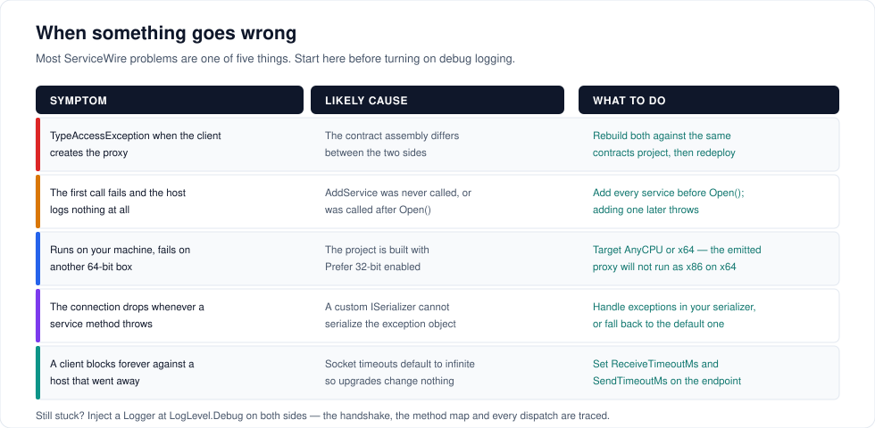

# Troubleshooting



---

## `TypeAccessException: SyncInterface failed. Type or version of type unknown.`

The host does not recognise the interface the client asked for.

**Check, in order:**

1. **Is the service added?** `AddService<IMath>(...)` must run **before** `Open()`. Adding after throws, and a host with no services answers every sync with "unknown".
2. **Is it the same interface?** ServiceWire matches on the namespace-qualified type name and the assembly *name*. Version, culture and public key token are stripped, so those may differ — the names may not. `Contoso.IMath` in `Contoso.Contracts.dll` on one side and `Contoso.Api.IMath` on the other will not match.
3. **Did you copy the contract instead of referencing it?** Two identical source files in two differently named assemblies are two different types.

The fix is almost always to put the contract in one class library and project-reference it from both sides. See [Getting started](getting-started.md#1-create-the-projects).

---

## `Cannot match method 'X' to its server side equivalent`

The client's contract has a method the host's does not, or the parameter types differ.

The host is running an older contract than the client. Methods are matched by name and parameter type names, so:

- Adding a method to the host is safe; old clients ignore it.
- Adding a method to the client and calling it against an old host produces this error.
- Renaming a method or changing a parameter type breaks both directions.

Deploy the host first when adding methods. See [Versioning a contract](contracts.md#versioning-a-contract).

---

## It works on my machine, and nowhere else

**The dynamically generated proxy will not run as x86 on an x64 system.** Visual Studio's console template enables *Prefer 32-bit* by default, so a build that works in one place fails in another.

```xml
<PropertyGroup>
  <PlatformTarget>AnyCPU</PlatformTarget>
  <Prefer32Bit>false</Prefer32Bit>
</PropertyGroup>
```

Set this on the **client** project — it is the side that emits the proxy — and on any project that uses `Interceptor.Intercept`.

---

## The connection dies whenever my service method throws

You have injected a custom `ISerializer` that cannot serialize an exception. The failure happens while the host is writing the response, so the connection goes with it and you never see the original exception.

Test your serializer directly:

```csharp
var s = new MyCustomSerializer();
var bytes = s.Serialize<Exception>(new InvalidOperationException("boom"));
Assert.Equal("boom", s.Deserialize<Exception>(bytes).Message);
```

The default serializer handles this correctly as of 7.0. See [Serialization and compression](serialization.md#the-one-thing-a-custom-serializer-must-get-right).

---

## A client blocks forever

The host went away mid-call and the socket has no receive timeout. Timeouts default to infinite so that upgrading ServiceWire never changes an existing application's behaviour — which means you have to opt in.

```csharp
var endPoint = new TcpEndPoint(new IPEndPoint(ip, 8098), connectTimeOutMs: 5000)
{
    ReceiveTimeoutMs = 30_000,
    SendTimeoutMs    = 30_000
};
```

Set the matching properties on `TcpHost` too, so a stalled client cannot hold a host thread indefinitely.

---

## The client cannot connect at all

**TCP:**

- Is the host `Open`? Check `host.Status` — a `Faulted` listener looks exactly like a closed port from outside. See [Logging and diagnostics](observability.md#is-the-host-still-listening).
- Did the host bind the interface you are dialling? `new TcpHost(8098)` binds `IPAddress.Any`; `new TcpHost(new IPEndPoint(specific, 8098))` binds one address.
- Firewall, and — on Windows — port reservations and ephemeral port exhaustion if you are creating clients in a loop.

**Named pipes:**

- Names are case-insensitive but must otherwise match exactly. Pass just the name, not `\\.\pipe\name` — ServiceWire adds the prefix.
- Cross-machine pipes need `new NpEndPoint(serverName, pipeName)` and Windows file-sharing between the two hosts.
- If the host runs as a service and the client as a desktop user, you almost certainly need a pipe ACL. See [Controlling who may connect](transports.md#controlling-who-may-connect).

---

## `InvalidCredentialException: authentication failed`

The zero-knowledge handshake failed. Three causes, in order of likelihood:

1. **The stored hash was regenerated.** `ZkProtocol.HashCredentials` makes a **new random salt every call**. Call it once at registration, persist `Salt`, `Key` *and* `Verifier`, and never call it again for that user.
2. **`GetPasswordHashSet` returned `null`.** That is how "no such user" is signalled — check your lookup, including case sensitivity on the username.
3. **The client is not using a `TcpZkEndPoint`.** A host with a repository requires every client to authenticate; a plain `TcpEndPoint` against it fails.

See [Security](security.md#tcp-zero-knowledge-login).

---

## Calls are slower than I expected

Work down this list:

1. **Are you creating a client per call?** Connection setup is 1–15 ms; a steady-state call is 15–50 µs. This is a three-orders-of-magnitude mistake and by far the most common one.
2. **Is compression on for small payloads?** It is off by default. If you turned it on, measure with it off.
3. **Are you sending `List<T>` where an array would do?** Arrays of primitives skip the serializer entirely.
4. **Did you inject an `IStats` or a custom `ILog`?** Both add per-call work; a custom `ILog` also makes ServiceWire build debug strings it would otherwise skip.
5. **Sequential loopback workload?** Try `UseWireV2 = false`. Anything concurrent or across a real network should stay on the default.

[Performance](performance.md) has the measured numbers behind each of these.

---

## Two `TcpClient` types

`ServiceWire.TcpIp.TcpClient<T>` and `System.Net.Sockets.TcpClient` collide when both namespaces are imported.

```csharp
using SwTcpClient = ServiceWire.TcpIp.TcpClient<MyApp.Contracts.IMath>;

using var client = new SwTcpClient(endPoint);
```

`LogLevel` collides similarly with `Microsoft.Extensions.Logging.LogLevel`; alias one of them.

---

## Things that are not bugs

- **`await` does not free the calling thread.** `Task` returns are unwrapped on the wire; the call is synchronous. See [Async and Task returns](contracts.md#async-and-task-returns).
- **`CancellationToken` parameters do nothing.** There is no cancellation across the wire.
- **`out decimal` / `ref Guid` are not supported.** Non-primitive value types cannot be passed by reference; constructing the client throws `NotSupportedException: Non-primitive native types (e.g. Decimal and Guid) ByRef are not supported.` Return a result type instead.
- **Generic methods are not supported.** `T Echo<T>(T value)` on a contract makes client construction fail. Use concrete overloads.
- **Events are not supported.** The proxy builds, but `+=` throws — a delegate cannot cross the wire. There is no server-initiated callback channel.
- **One connection's calls run in order.** The host executes a connection's requests strictly in order, so a slow method delays what is queued behind it on that connection. Spread work across a few clients if that matters.
- **Your service is a singleton.** One instance serves every client. Guard mutable state.

---

## When none of the above fits

1. Inject `new Logger(logLevel: LogLevel.Debug)` on **both** sides, into different directories.
2. Reproduce **once**. Debug logging is verbose and writes payload contents to disk.
3. On the client log, find the interface sync. Missing → connection or contract-name problem.
4. On the host log, find the invocation entry. Present → the request arrived; the problem is in your service or the response. Absent → it never got there.
5. Turn debug logging back off.

If it looks like a library bug, the [issue tracker](https://github.com/tylerjensen/ServiceWire/issues) wants the contract interface, both log excerpts, and the ServiceWire and .NET versions on each side.

---

[← Back to the user guide](user-guide.md)
