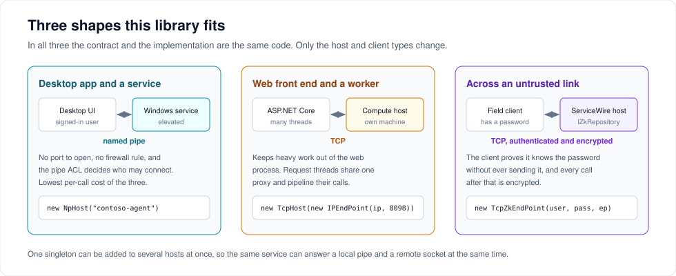
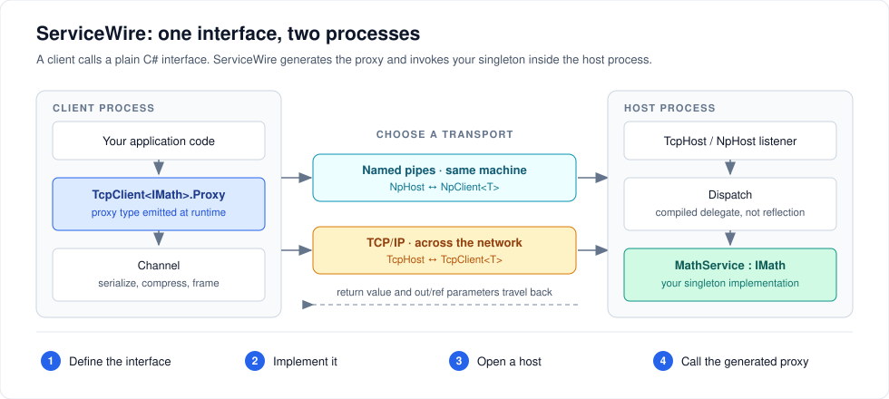

# ServiceWire User Guide

ServiceWire is an RPC library for .NET processes that already trust each other. You write a plain C# interface, implement it once, host it, and call it from another process as if it were local. There is no IDL, no code generator, no attributes and no build step — the client proxy is emitted at runtime from the interface you already have.



---

## Start here

| If you want to… | Read |
| --- | --- |
| Get a host and a client talking in ten minutes | [Getting started](getting-started.md) |
| Know what you can put in a method signature | [Designing contracts](contracts.md) |
| Choose between named pipes and TCP | [Transports and endpoints](transports.md) |
| Send your own types, or swap the serializer | [Serialization and compression](serialization.md) |
| Authenticate callers and encrypt the link | [Security](security.md) |
| See logs, timings and listener health | [Logging and diagnostics](observability.md) |
| Add timing, auditing or retries around a method | [Interception](interception.md) |
| Understand what actually goes over the wire | [Wire protocol](wire-protocol.md) |
| Make it faster, or know what "fast" means here | [Performance](performance.md) |
| Move from 6.x to 7.0 | [Migrating to 7.0](migrating-to-v7.md) |
| Fix something that is broken | [Troubleshooting](troubleshooting.md) |

---

## Install

```shell
dotnet add package ServiceWire
```

The package targets `netstandard2.0` and `net8.0`, so it runs on .NET Framework 4.6.1+, .NET Core, and every modern .NET. The `net8.0` assembly has no package dependencies.

> 7.0 currently ships as `7.0.0-preview.1`. Add `--prerelease` to the command above to pick it up, or stay on 6.0.1 until the final release — [both interoperate](migrating-to-v7.md).

---

## The whole idea in four steps

```csharp
// 1. A contract both processes reference
public interface IMath
{
    int Add(int a, int b);
}

// 2. An implementation, hosted as a singleton
public class MathService : IMath
{
    public int Add(int a, int b) => a + b;
}

// 3. A host
using var host = new TcpHost(8098);
host.AddService<IMath>(new MathService());
host.Open();

// 4. A client
using var client = new TcpClient<IMath>(new TcpEndPoint(new IPEndPoint(IPAddress.Loopback, 8098)));
int sum = client.Proxy.Add(2, 3);   // 5
```

Swap `TcpHost`/`TcpClient` for `NpHost`/`NpClient` and the same code runs over a named pipe. Nothing else changes.

The full three-project walkthrough, including the `.csproj` files and how to run it, is in [Getting started](getting-started.md).

---

## What is actually happening



1. **On connect**, the client sends the interface's type name and the host answers with a *method map*: an integer identifier for every method, its parameter types, and the capabilities the host supports. This happens once per interface per endpoint and is cached process-wide.
2. **On each call**, the proxy writes the method identifier and the parameter values, then blocks until the matching response arrives.
3. **On the host**, one thread per connection reads the request, invokes your singleton through a compiled delegate, and writes back the return value plus any `out` and `ref` values.
4. **If your method throws**, the exception is carried back and rethrown on the caller's thread. The connection stays up.

Two things follow from this that surprise people, so they are worth saying up front:

- **Your service is a singleton.** One instance answers every client on the host. Make it thread-safe, or guard it yourself. The host does execute one connection's requests in order, but different connections run concurrently.
- **Calls are synchronous.** `Task`-returning methods work, but the task is unwrapped on the wire and your method runs synchronously on a host thread. See [Async and Task returns](contracts.md#async-and-task-returns).

---

## Reference by type

| Type | Namespace | What it is |
| --- | --- | --- |
| `TcpHost` | `ServiceWire.TcpIp` | Listens on an `IPEndPoint` |
| `TcpClient<T>` | `ServiceWire.TcpIp` | Owns a connection; exposes `Proxy` |
| `TcpEndPoint` | `ServiceWire.TcpIp` | Address plus timeouts and wire options |
| `TcpZkEndPoint` | `ServiceWire.TcpIp` | The same, with a username and password |
| `NpHost` | `ServiceWire.NamedPipes` | Listens on a named pipe |
| `NpClient<T>` | `ServiceWire.NamedPipes` | Owns a pipe connection; exposes `Proxy` |
| `NpEndPoint` | `ServiceWire.NamedPipes` | Server name, pipe name, timeout, wire options |
| `Host` | `ServiceWire` | Base class: `AddService`, `Open`, `Close`, `Status`, `UseCompression` |
| `ISerializer` | `ServiceWire` | Plug in your own object serializer |
| `ICompressor` | `ServiceWire` | Plug in your own compression |
| `ILog`, `IStats` | `ServiceWire` | Plug in logging and timing |
| `IZkRepository` | `ServiceWire.ZeroKnowledge` | Look up a user's stored password hash |
| `Interceptor` | `ServiceWire.Aspects` | Wrap any local object with pre/post/exception hooks |

---

## Working code in this repository

These are built and tested on every commit, so they never drift from the library:

| Sample | What it shows |
| --- | --- |
| [`src/Demo/DemoCommon/Contracts.cs`](../src/Demo/DemoCommon/Contracts.cs) | A shared contract assembly with complex types and `out` parameters |
| [`src/Demo/DemoHost/Program.cs`](../src/Demo/DemoHost/Program.cs) | Hosting four interfaces on one TCP endpoint |
| [`src/Demo/DemoClient/Program.cs`](../src/Demo/DemoClient/Program.cs) | Client usage, including the zero-knowledge variant |
| [`src/Tests/Unit/ServiceWireTests/TcpTests.cs`](../src/Tests/Unit/ServiceWireTests/TcpTests.cs) | TCP hosting and calls, end to end |
| [`src/Tests/Unit/ServiceWireTests/NpTests.cs`](../src/Tests/Unit/ServiceWireTests/NpTests.cs) | The same over named pipes |
| [`src/Tests/Unit/ServiceWireTests/TcpZkTests.cs`](../src/Tests/Unit/ServiceWireTests/TcpZkTests.cs) | Zero-knowledge authentication |
| [`src/Tests/Unit/ServiceWireTests/InterceptionTests.cs`](../src/Tests/Unit/ServiceWireTests/InterceptionTests.cs) | Cross-cutting concerns |
| [`src/Tests/Unit/ServiceWireTests/PipeliningTests.cs`](../src/Tests/Unit/ServiceWireTests/PipeliningTests.cs) | Many threads sharing one proxy |
| [`src/Tests/Unit/ServiceWireTests/AsyncTests.cs`](../src/Tests/Unit/ServiceWireTests/AsyncTests.cs) | A custom serializer and a thrown exception |

---

[← Back to the README](../README.md)
