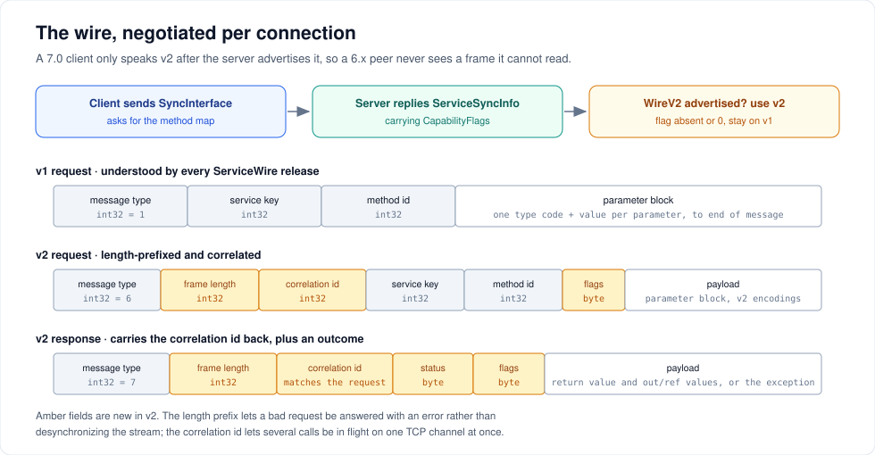

# Wire protocol

You do not need this page to use ServiceWire. Read it if you are debugging a connection, writing a custom `ISerializer`, or deciding whether to opt out of the v2 wire.



---

## Message types

Every message starts with a 4-byte little-endian `MessageType`:

| Value | Name | Direction |
| --- | --- | --- |
| 0 | `TerminateConnection` | client → host |
| 1 | `MethodInvocation` | client → host (v1) |
| 2 | `ReturnValues` | host → client (v1) |
| 3 | `UnknownMethod` | host → client (v1) |
| 4 | `ThrowException` | host → client (v1) |
| 5 | `SyncInterface` | client → host |
| 6 | `MethodInvocation2` | client → host (v2) |
| 7 | `Response2` | host → client (v2) |
| 20 | `ZkInitiate` | client → host |
| 21 | `ZkProof` | client → host |

---

## Connecting

A client's first act is `SyncInterface`: it sends the contract's type name and the host replies with a serialized `ServiceSyncInfo`.

```csharp
public class ServiceSyncInfo
{
    public int ServiceKeyIndex { get; set; }     // which service on this host
    public MethodSyncInfo[] MethodInfos { get; set; }   // ident, name, return type, parameter types
    public bool UseCompression { get; set; }     // the host's setting, used in both directions
    public int CompressionThreshold { get; set; }
    public int CapabilityFlags { get; set; }     // ProtocolCapabilities bit flags — 7.0+
}
```

A zero-length reply means the host does not know that type, and the client throws `TypeAccessException`.

The result is cached process-wide, keyed by interface plus endpoint identity, so a second client for the same contract against the same host skips the round trip.

---

## Negotiating the wire version

`CapabilityFlags` is the whole mechanism.

```csharp
[Flags]
public enum ProtocolCapabilities
{
    None   = 0,
    WireV2 = 1
}
```

- A **6.x host** does not have the field. Every serializer deserializes it to `0`, so a 7.0 client sees no capability and stays on v1.
- A **6.x client** does not know the field exists. A tolerant serializer ignores it; the client stays on v1 regardless of what the host advertises.
- **Both on 7.0** and the client uses v2.

A client never sends a v2 frame it has not seen advertised, which is why every mixed pairing works. See [Migrating to 7.0](migrating-to-v7.md) for the full matrix.

---

## The v1 frame

Request:

```text
int32   MessageType.MethodInvocation (1)
int32   service key index
int32   method identifier
        parameter block, to the end of the message
```

Response:

```text
int32   MessageType.ReturnValues (2) | ThrowException (4) | UnknownMethod (3)
        parameter block, to the end of the message
```

The parameter block is a count followed by one type code and value per parameter. There is no length prefix anywhere, which is its one real weakness: if a payload cannot be decoded, the reader has no way to find where the next message begins, so the connection has to be dropped.

Every ServiceWire release from 1.5.0 onward reads and writes this format, and 7.0's golden tests assert it is byte-identical to 6.x.

---

## The v2 frame

Request:

```text
int32   MessageType.MethodInvocation2 (6)
int32   frame length  = 13 + payload length
int32   correlation id
int32   service key index
int32   method identifier
byte    flags
        payload (parameter block, v2 encodings)
```

Response:

```text
int32   MessageType.Response2 (7)
int32   frame length = 6 + payload length
int32   correlation id  (matches the request)
byte    status   0 = values, 1 = exception, 2 = unknown method
byte    flags
        payload
```

Three things follow from the added fields.

**A bad request no longer kills the connection.** The length prefix lets the host consume the whole frame before trying to decode it. A decode failure comes back as a correlated error response and the connection carries on.

**Calls can overlap.** The correlation id lets a client have several requests in flight and match each response to the caller waiting for it.

**`DateTime` stops going through strings.** v2 adds two type codes — `0x15` for a scalar and `0x55` for an array — carrying `DateTime.ToBinary()` as an `int64`. `Kind` is preserved without formatting or parsing. These codes appear only inside v2 frames.

---

## What each transport does with v2

**TCP pipelines.** A socket can carry a read and a write at once. Many threads can share one `TcpClient<T>` proxy; each blocks only on its own correlated response. Whichever caller holds the read seat drains frames and completes the others' pending entries as their responses stream past, so an uncontended caller reads inline with no thread handoff. The host still executes one connection's requests strictly in order.

**Named pipes do not.** A synchronous pipe handle cannot overlap a read with a write, so v2 calls on a pipe serialize the whole exchange. Pipes still get the decode-error resilience and the binary `DateTime` transfer.

---

## The cost, and when to opt out

A v2 frame costs a few microseconds and a little over 1 KB of allocation per call compared with v1. On a real network that is far below the round-trip time, and on TCP the pipelining more than repays it. On loopback, with a strictly sequential caller and no concurrency to exploit, it is measurable.

Three opt-outs force the classic wire:

```csharp
// per host, for all of its clients — before AddService
var host = new TcpHost(8098);
host.EnableWireV2 = false;
host.AddService<IMath>(new MathService());
host.Open();

// per client
var tcp = new TcpEndPoint(ipEndPoint) { UseWireV2 = false };
var pipe = new NpEndPoint("my-pipe") { UseWireV2 = false };
```

> `EnableWireV2` is captured into the method map when `AddService` runs. Setting it afterwards changes nothing.

Forcing v1 on named pipes measured about 50% faster than 6.0.1 for sequential small calls, at 320 bytes allocated per call — the Tier 1 buffering and dispatch work in 7.0 is independent of the wire version. That is the configuration to choose for a purely sequential, local, latency-critical workload. Everything else should stay on the default.

---

## Zero-knowledge and framing

When a connection is authenticated, the parameter block is encrypted before it is written and decrypted after it is read. On v2 the encrypted bytes are the frame payload, so framing and encryption compose without either knowing about the other. The `SyncInterface` exchange is encrypted too, including the type name.

---

## Cached capabilities and in-place upgrades

Because `ServiceSyncInfo` is cached process-wide, a host that is *downgraded* in place — 7.0 replaced by 6.x on the same endpoint — can leave a client holding a stale "supports v2" belief. ServiceWire detects this on the first v2 call: it produces a descriptive error and evicts the cache entry, so the next channel renegotiates.

You can also clear it yourself, which is useful in tests and in long-lived processes that survive a host restart:

```csharp
ServiceWire.StreamingChannel.ClearCachedSyncInfo();
```

---

## Verification

- [`WireFormatGoldenTests.cs`](../src/Tests/Unit/ServiceWireTests/WireFormatGoldenTests.cs) — asserts the v1 bytes have not moved
- [`WireV2Tests.cs`](../src/Tests/Unit/ServiceWireTests/WireV2Tests.cs) — v2 encodings and frame handling
- [`PipeliningTests.cs`](../src/Tests/Unit/ServiceWireTests/PipeliningTests.cs) — concurrent callers on one proxy
- [`InteropMatrixTests.cs`](../src/Tests/Interop/InteropTests/InteropMatrixTests.cs) — runs the published 6.0.1 package as a separate process against 7.0 in both directions, on TCP and named pipes, with and without compression

---

## Next steps

- [Migrating to 7.0](migrating-to-v7.md) — what this means for a mixed fleet
- [Performance](performance.md) — the numbers behind the trade-off
- [Serialization and compression](serialization.md) — what fills the payload

---

[← Back to the user guide](user-guide.md)
